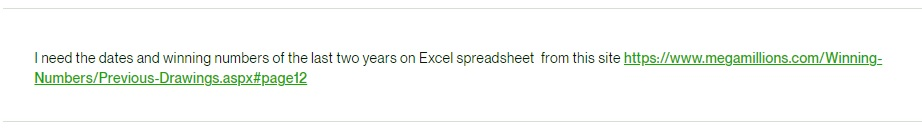

# Проект для сбора данных о предыдущих розыгрышах Mega Millions

## Описание

Этот проект представляет собой скрипт на Python для сбора данных о предыдущих розыгрышах лотереи Mega Millions с веб-сайта. 
Скрипт использует библиотеки Selenium и BeautifulSoup для автоматизации веб-браузера и парсинга HTML-страницы. 
Он извлекает информацию о датах розыгрышей, мегаплеере и выигрышных номерах, а затем сохраняет эти данные в формате Excel.

## Задача

## Использование

1. Установите необходимые библиотеки, если они еще не установлены. 
Вы можете использовать команду `pip install -r requirements.txt` для установки библиотек, указанных в файле requirements.txt.

2. Запустите скрипт, выполнив команду:

    > python megamillions_website.py

    Скрипт начнет сбор данных о предыдущих розыгрышах лотереи Mega Millions. 
    По умолчанию, скрипт обрабатывает определенную страницу.

3. По завершении выполнения скрипта, данные будут сохранены в файле `previous_drawings.xlsx`.

## Параметры конфигурации

Вы можете настроить параметры скрипта, изменив значения в функции `main()` в файле `megamillions_website.py`:

- url: страница для сбора данных.

## Зависимости

Для работы скрипта необходимы следующие библиотеки:

- Selenium для автоматизации веб-браузера.
- BeautifulSoup для парсинга HTML-страниц.
- Pandas для работы с данными в формате Excel.
- Lxml для более эффективного парсинга HTML-страниц с использованием BeautifulSoup.
- Openpyxl для работы с данными в формате Excel.

Убедитесь, что вы установили эти библиотеки перед запуском скрипта.

## Примечания

- Этот скрипт предназначен только для образовательных целей